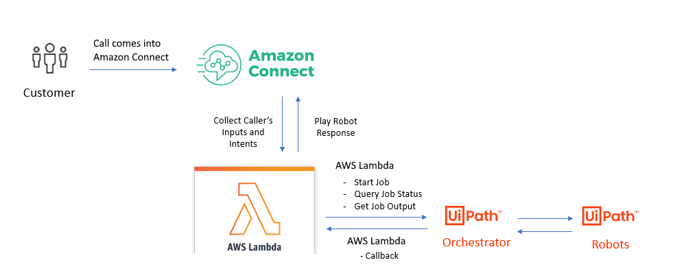

# Amazon Connect powered by UiPath


IVR (“Interactive Voice Response”) systems are often the first point of contact for customers as part of an enterprise’s contact care system.  Unfortunately, IVRs often fall short on the promise of providing “self-service” solutions for customers as IVRs are only capable of connecting to systems that are accessible via API, which even when available can be expensive to implement such solutions.

With UiPath’s Robotic Process Automation (RPA) platform, Amazon Connect can be connected to any system via RPA, drastically expanding IVR fulfillment capabilities to gather information and perform actions across a plethora of systems from on-prem mainframes to cloud-based web services. Increasing the success rate of customer requests being fulfilled by the self-service IVR frees your contact center agents up to work on more complex customer issues. The results? Improved customer and employee experiences, enhanced accuracy, reduced Average Handling Time (“AHT”), and acceleration of your digital transformation initiatives, resulting in a rapid return on investment.



This repro contains everything you need to quickly incorporate UiPath automation into your Amazon Connect contact flows.
- AWS Lambda functions
- Sample Inbound and Outbound Amazon Connect Contact Flows
- Sample Processes

## Demo description
We have created two distinct demos to show off different use cases for interacting with Amazon Connect

### Fulfilling IVR requests with UiPath automation [Inbound]
Aileen is a customer of Meeple Telco and wants to know the current balance for her mobile phone bill.  She makes a voice call to her Meeple Telco customer service number and the IVR flow queries the back-end for her last bill date and total. Aileen is thrilled that she was able to answer her question in under 30 seconds and without having to talk to anyone!

### Outbound Calling [Outbound]
An attended automation queries an Excel spreadsheet for applicants that are missing data from their applications, namely their social security number.  The automation uses Amazon Connect to call each applicant and when they pick-up the call, are prompted to enter their social security number.  This data is then updated in the Excel spreadsheet.

## Deployment Steps
*NOTE: We are working on building a Cloud Formation template to automate this deployment process.  We'll update the repo as soon as it becomes available.  ETA is June 2020.*

### Step 1. Prepare an Amazon Connect instance
1. Sign in to your AWS account at https://aws.amazon.com with an AWS Identity and
Access Management (IAM) user role that has the necessary permissions.
2. If you don’t already have an Amazon Connect instance, see the [AWS documentation](https://docs.aws.amazon.com/connect/latest/adminguide/amazon-connect-get-started.html) for information on how to create an Amazon Connect instance.

### Step 2. Create & configure your UiPath Cloud instance
1. Create a [new UiPath cloud instance](https://platform.uipath.com/portal_/register), or [use an existing instace](https://cloud.uipath.com)
2. Download the sample processes [in this repo](./processes), or use your own processes
 - Inbound Demo
   - BillLookup - an unattended automation that takes a phone number as input and returns the last monthly bill details
 - Outbound Demo
   - OutboundLauncher - an attended automation that takes an Excel spreadsheet as input and initiates an outgoing call to each customer in the file using Amazon Connect
   - UpdateSpreadsheet - an unattended automation that social security number for a given record matching a phone number in an Excel spreadsheet
3. Publish the processes from Studio to Orchestrator - [HowTo](https://docs.uipath.com/orchestrator/docs/publishing-a-project-from-studio-to-orchestrator)
4. Deploy the processes - [HowTo](https://docs.uipath.com/orchestrator/docs/managing-processes)
5. Generate a user key and client ID for your cloud instance - [HowTo](https://docs.uipath.com/cloudplatform/docs/about-api-access)
6. Note down the following information as it will be needed in later steps:
   - User Key
   - Client Id
   - Account logical name
   - Tenant logical name 
7. [Optional] If you want to run the Outbound Demo, you need to download and install the [Amazon CLI](https://aws.amazon.com/cli/) to your machine as the process uses it to make a call with Amazon Connect.

### Step 3. Create lambda functions
AWS Lambda functions will be the glue that connect Amazon Connect and UiPath.  There are two primary lambda functions:
   - UiPathStartJob - Queue a UiPath automation job, with inputs
   - UiPathQueryJob - Check the status of a job

And three helper lambda functions:
   - UiPathPackInputs - Package the inputs from Amazon Connect into a JSON packet
   - UiPathQueryReleaseKey - Get the release key guid for a given process name
   - UiPathAuthenticate - Get an access token for interacting with the UiPath Cloud Orchestrator

1. Open the [AWS Lambda console](https://console.aws.amazon.com/lambda/home)
2. Set the region to the same region as your Amazon Connect instance.  *NOTE: Amazon Connect only supports using lambda functions in the same region as your contact center.*
3. Download the UiPath AWS Lambda function deplyoment packages from the release tab on this repo, or edit the [source code](./functions) and build your own using the documentation on [building Lambda Functions with C#](https://docs.aws.amazon.com/lambda/latest/dg/lambda-csharp.html)
4. [Create 5 new AWS Lambda functions](https://docs.aws.amazon.com/lambda/latest/dg/getting-started-create-function.html) and upload the related code package you downloaded above:

| Function name                     | Runtime       | Package                   | Handler                                                    |
|-----------------------------------|---------------|---------------------------|------------------------------------------------------------|
| UiPathAuthenticate    | .NET Core 3.1 | UiPathAuthenticate.zip    | Authenticate::Authenticate.Function::FunctionHandler       |
| UiPathQueryReleaseKey | .NET Core 3.1 | UiPathQueryReleaseKey.zip | QueryReleaseKey::QueryReleaseKey.Function::FunctionHandler |
| UiPathStartJob        | .NET Core 3.1 | UiPathStartJob.zip        | StartJob::StartJob.Function::FunctionHandler               |
| UiPathQueryJob        | .NET Core 3.1 | UiPathQueryJob.zip        | QueryJob::QueryJob.Function::FunctionHandler               |
| UiPathPackInputs                  | Node.js 12.x  | See code below  | index.handler              |

#### UiPathPackInputs code
```exports.handler = async (event) => {
    const inputParams =  JSON.stringify(event['Details']['Parameters']);
    const response ={inputParams};
    return response;
};
```    

### Step 4. Create the contact flows in Amazon Connect
1. Open the Amazon Connect console at https://console.aws.amazon.com/connect/.
2. Add the Lambda Functions to Your Amazon Connect Instance by following the [AWS documentation](https://docs.aws.amazon.com/connect/latest/adminguide/connect-lambda-functions.html#add-lambda-function).  Specifically, you need to add UiPathStartJob and UiPathQueryJob.
3. Download the sample contact flows [in this repo](./contactflows)
4. Import the sample contact flows into Amazon Connect by following the [Amazon Connect documentation](https://docs.aws.amazon.com/connect/latest/adminguide/contact-flow-import-export.html)
5. Make the following changes to the contact flows to customize them for your own environment

**Inbound**
 - Invoke AWS Lambda function #1
   - Function: UiPathStartJob
   - Inputs:
      - accountName - provide the account name from step 2.6 above
      - tenantName - provide the tenant name from step 2.6 above
      - clientId - provide the clientId name from step 2.6 above
      - userKey - provide the UserKey name from step 2.6 above
      - releaseKey - provide the GUID for the process to run, [see below](#Obtaining-a-release-key)
      - organizationUnitId - provide the ID for the Orchestrator folder, [see below](#Obtaining-the-organization-Unit-Id)

 - Invoke AWS Lambda function #2
   - Function: UiPathQueryJob
      - accountName - provide the account name from step 2.6 above
      - tenantName - provide the tenant name from step 2.6 above
      - organizationUnitId - provide the ID for the Orchestrator folder, [see below](#Obtaining-the-organization-Unit-Id)

**Outbound**
  - Invoke AWS Lambda function #2
    - Function: UiPathStartJob
    - Inputs:
      - accountName - provide the account name from step 2.6 above
      - tenantName - provide the tenant name from step 2.6 above
      - clientId - provide the clientId name from step 2.6 above
      - userKey - provide the UserKey name from step 2.6 above
      - releaseKey - provide the GUID for the process to run, [see below](#Obtaining-a-release-key)
      - organizationUnitId - provide the ID for the Orchestrator folder, [see below](#Obtaining-the-organization-Unit-Id)

### Step 5. Configure & test your flows 
1. [Associate a phone number with a contact flow](https://docs.aws.amazon.com/connect/latest/adminguide/associate-phone-number.html)
2. [Follow the guidance to associate the chat test settings with a contact flow](https://docs.aws.amazon.com/connect/latest/adminguide/chat-testing.html)
3. [Test out the voice or chat experience](https://docs.aws.amazon.com/connect/latest/adminguide/chat-testing.html)

**NOTE: If the contact flow fails, try again.  The cold start generally takes longer than the Amazon Connect lambda allows but once the system is in a warm state, the performance improves significantly**

#### Configuring the Outbound Demo for your Amazon Connect instance
For the outbound demo, the OutboundLauncher process uses the command line to make a call with Amazon Connect.  Here are a few things for you to do to run this demo:
1. [Associate your phone number with the outbound contact flow](https://docs.aws.amazon.com/connect/latest/adminguide/associate-phone-number.html)
2. Open the UiPath Outbound example flow in the Amazon Connect console and note down two GUIDs from the URL:
    - instanceId: the GUID immediately following :instance/ (i.e. ccb2057c-f7eb-44a9-af39-e4172dcbcb10)
    - flowId: the final GUID in the URL (e.g. 1e2ac5e3-2b5a-4872-883a-fca068927c0c)
    Here's an example URL: https://jmarksuipath.awsapps.com/connect/contact-flows/edit?id=arn:aws:connect:us-west-2:456365885395:instance/**ccb2057c-f7eb-44a9-af39-e4172dcbcb10**/contact-flow/**1e2ac5e3-2b5a-4872-883a-fca068927c0c**
3. [Run the OutboundLauncher process through orchestrator](https://docs.uipath.com/activities/docs/start-job) and pass the following inputs:
    - inputExcelFile: Location of the ExceptionList.xls Excel file with the list of numbers to applicants to call (update the first row to have a phone number you can interact with)
    - outboundPhoneNumber: Phone number that you've [claimed in Amazon Connect](https://docs.aws.amazon.com/connect/latest/adminguide/claim-phone-number.html).  Note it must be in the format **+14255551212**
    - instanceId: the instanceId from #2 above.
    - flowId: the flowId from #2 above.
    
needs to be updated like your inbound launcher process to parameterize excel file, and instructions to update the command line to match connect instance id, flow instance id and outbound phone number.

#### Obtaining the organization unit id
The Organization Unit Id represents the Orchestrator folder your processes are stored in.  
1. Open up a browser and sign into your [Cloud Orchestrator instance](http://cloud.uipath.com)
2. Navigate to https://cloud.uipath.com/ACCOUNT/TENANT/odata/Folders where ACCOUNT is your account name and tenant is your tenant name (see step 2.6 above).  This will return a JSON blob like the following:

```
{
  "@odata.context": "https://cloud.uipath.com/jmarks/jmarks/odata/$metadata#Folders",
  "@odata.count": 3,
  "value": [
    {
      "DisplayName": "Default",
      "FullyQualifiedName": "Default",
      "FullyQualifiedNameOrderable": "Default",
      "Description": null,
      "ProvisionType": "Manual",
      "PermissionModel": "InheritFromTenant",
      "ParentId": null,
      "IsActive": true,
      "Id": 60193
    },
    {
      "DisplayName": "HR",
      "FullyQualifiedName": "HR",
      "FullyQualifiedNameOrderable": "HR",
      "Description": null,
      "ProvisionType": "Manual",
      "PermissionModel": "InheritFromTenant",
      "ParentId": null,
      "IsActive": true,
      "Id": 227316
    }
  ]
}
```
3. Take the Id field for the folder your processes are stored in.  The DisplayName is likely 'Default' like in the example above.

#### Obtaining a release key 
We have provided a helper Lambda function, UiPathQueryReleaseKey, for converting a process name into the release key GUID.  You can manually run the lambda from the Lambda Console to get the value you need to provide in the contact flow configuration in step 4.5.  Below is an example of the input you need to pass

##### Format
```
{
  "Details": {
    "Parameters": {
      "clientId": "YOUR_CLIENT_ID",
      "userKey": "YOUR_USER_KEY"
      "accountName": "YOUR_ACCOUNT_NAME",
      "tenantName": "YOUR_TENANT_NAME",
      "organizationUnitId": YOUR_ORGANIZATION_ID,
      "processName": "PROCESSNAME"
    }
  }
}
```

##### Example

```{
  "Details": {
    "Parameters": {
      "clientId": "9EEv1ALOPczW3y4ABCDL3jYf62jK21n5",
      "userKey": "yek-LSGrRk2G8EO_rEKM70i2kPAXt9H_c6Z1bFrweABCe"
      "accountName": "jmarks",
      "tenantName": "jmarks",
      "organizationUnitId": 60193,
      "processName": "BillLookup"
    }
  }
}
```

To post feedback, submit feature ideas, or report bugs, use the Issues section of this GitHub repo.