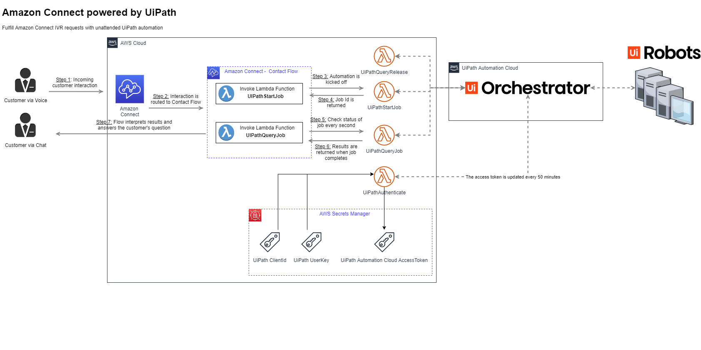

# Amazon Connect powered by UiPath

IVR (“Interactive Voice Response”) systems are often the first point of contact for customers as part of an enterprise’s contact care system.  Unfortunately, IVRs often fall short on the promise of providing “self-service” solutions for customers as IVRs are only capable of connecting to systems that are accessible via API, which even when available can be expensive to implement such solutions.

With UiPath’s Robotic Process Automation (RPA) platform, Amazon Connect can be connected to any system via RPA, drastically expanding IVR fulfillment capabilities to gather information and perform actions across a plethora of systems from on-prem mainframes to cloud-based web services. Increasing the success rate of customer requests being fulfilled by the self-service IVR frees your contact center agents up to work on more complex customer issues. The results? Improved customer and employee experiences, enhanced accuracy, reduced Average Handling Time (“AHT”), and acceleration of your digital transformation initiatives, resulting in a rapid return on investment.



This repo contains everything you need to quickly incorporate UiPath automation into your Amazon Connect contact flows.
- AWS CloudFormation Template
- AWS Lambda functions
- Sample Inbound and Outbound Amazon Connect Contact Flows
- Sample UiPath Processes

## Demo description
We have created two distinct demos to show off different use cases for interacting with Amazon Connect

### Fulfilling IVR requests with UiPath automation [Inbound]
Aileen is a customer of Meeple Telco and wants to know the current balance for her mobile phone bill.  She makes a voice call to her Meeple Telco customer service number and the IVR flow queries the back-end for her last bill date and total. Aileen is thrilled that she was able to answer her question in under 30 seconds and without having to talk to anyone!

### Outbound Calling [Outbound]
An attended automation queries an Excel spreadsheet for applicants that are missing data from their applications, namely their social security number.  The automation uses Amazon Connect to call each applicant and when they pick-up the call, are prompted to enter their social security number.  This data is then updated in the Excel spreadsheet.

## Deployment Steps

### Step 1. Create & configure your UiPath Cloud instance
1. Create a [new UiPath cloud instance](https://platform.uipath.com/portal_/register), or [use an existing instace](https://cloud.uipath.com)
2. Download the sample processes [in this repo](./processes), or use your own processes
 - Inbound Demo
   - BillLookup - an unattended automation that takes a phone number as input and returns the last monthly bill details
 - Outbound Demo
   - OutboundLauncher - an attended automation that takes an Excel spreadsheet as input and initiates an outgoing call to each customer in the file using Amazon Connect
   - UpdateSpreadsheet - an unattended automation that social security number for a given record matching a phone number in an Excel spreadsheet
3. Publish the processes from Studio to Orchestrator - [HowTo](https://docs.uipath.com/orchestrator/docs/publishing-a-project-from-studio-to-orchestrator)
4. Deploy the processes - [HowTo](https://docs.uipath.com/orchestrator/docs/managing-processes)
5. Generate a user key and client ID for your cloud instance - [HowTo](https://docs.uipath.com/cloudplatform/docs/about-api-access)
6. Note down the following information as it will be needed in later steps:
   - User Key
   - Client Id
   - Account logical name
   - Tenant logical name 
7. [Optional] If you want to run the Outbound Demo, you need to download and install the [Amazon CLI](https://aws.amazon.com/cli/) to your machine as the process uses it to make a call with Amazon Connect.

### Step 2. Prepare an Amazon Connect instance
1. Sign in to your AWS account at https://aws.amazon.com with an AWS Identity and Access Management (IAM) user role that has the necessary permissions.
2. If you don’t already have an Amazon Connect instance, see the [AWS documentation](https://docs.aws.amazon.com/connect/latest/adminguide/amazon-connect-get-started.html) for information on how to create an Amazon Connect instance.

### Step 3. Run the CloudFormation Template
To make things easy to deploy, we've hosted the default template in UiPath's S3 bucket so all you have to do is create a new stack with it.  Alternatively, you can customize the [template in this repo](./aws-cft/contact-center-cft).

1. Open the [AWS CloudFormation Stack creator](https://us-west-2.console.aws.amazon.com/cloudformation/home?region=us-west-2#/stacks/create/template)
2. Set the region to the same region as your Amazon Connect instance.  *NOTE: Amazon Connect only supports using lambda functions in the same region as your contact center.*
3. Point to the UiPath hosted S3 URL: **[HOSTED URL HERE](https://s3-us-west-2.amazonaws.com/cf-templates-3o3brhjqodlu-us-west-2/20201325vp-CFT)** and click **Next**.
4. Fill in the form with the pertinent data
  - Stack Name - provide a name for your stack
    - EXAMPLE: UiPath-AmazonConnect
  - User Key - provide the UserKey name from step 1.6 above
    - EXAMPLE: GHFabdDEfGHiJkLm0N1QrS2t-3u4vw_XyZ5AB-6cde7Fg
  - Account Logical Name - provide the account name from step 1.6 above
    - EXAMPLE: MyAccountName
  - Tenant Logical Name - provide the tenant name from step 1.6 above
    - EXAMPLE: MyOrchestrator
  - Client Id - provide the clientId name from step 1.6 above
    - EXAMPLE: 8DEv1AMNXczW3y4U15LL3jYf62jK93n5
  - S3 Bucket
    - EXAMPLE: UiPath-AmazonConnect-ContactFlows
  5. Continue pressing **Next** for 2 screens.
  6. Check the **I acknowledge...** checkbox and finally click **Create Stack**.  It should take less than 2 minutes for all the resources to be created.
  7. Download the two sample contact flows from the links returned in the output of the stack creation.  These will be uploaded to Amazon Connect in the next step.


Here's an example of the completed form:


### Step 4. Create the contact flows in Amazon Connect
1. Open the Amazon Connect console at https://console.aws.amazon.com/connect/.
2. Import the sample contact flows, donwloaded in step 3.7 above, into Amazon Connect by following the [Amazon Connect documentation](https://docs.aws.amazon.com/connect/latest/adminguide/contact-flow-import-export.html)
3. Change the release key of the processes to launch in the contact flows per the details below:

**Inbound**
 - Invoke AWS Lambda function #1
   - Function: UiPathStartJob
   - Inputs:
      - releaseKey - provide the GUID for the process to run, [see below](#Obtaining-a-release-key)
      - organizationUnitId - provide the ID for the Orchestrator folder, [see below](#Obtaining-the-organization-Unit-Id)

**Outbound**
  - Invoke AWS Lambda function #2
    - Function: UiPathStartJob
    - Inputs:
      - releaseKey - provide the GUID for the process to run, [see below](#Obtaining-a-release-key)
      - organizationUnitId - provide the ID for the Orchestrator folder, [see below](#Obtaining-the-organization-Unit-Id)

### Step 5. Configure & test your flows 
1. [Associate a phone number with a contact flow](https://docs.aws.amazon.com/connect/latest/adminguide/associate-phone-number.html)
2. [Follow the guidance to associate the chat test settings with a contact flow](https://docs.aws.amazon.com/connect/latest/adminguide/chat-testing.html)
3. [Test out the voice or chat experience](https://docs.aws.amazon.com/connect/latest/adminguide/chat-testing.html)

#### Obtaining the organization unit id
The Organization Unit Id represents the Orchestrator folder your processes are stored in.  
1. Open up a browser and sign into your [Cloud Orchestrator instance](http://cloud.uipath.com)
2. Navigate to https://cloud.uipath.com/ACCOUNT/TENANT/odata/Folders where ACCOUNT is your account name and tenant is your tenant name (see step 2.6 above).  This will return a JSON blob like the following:

```
{
  "@odata.context": "https://cloud.uipath.com/jmarks/jmarks/odata/$metadata#Folders",
  "@odata.count": 3,
  "value": [
    {
      "DisplayName": "Default",
      "FullyQualifiedName": "Default",
      "FullyQualifiedNameOrderable": "Default",
      "Description": null,
      "ProvisionType": "Manual",
      "PermissionModel": "InheritFromTenant",
      "ParentId": null,
      "IsActive": true,
      "Id": 60193
    },
    {
      "DisplayName": "HR",
      "FullyQualifiedName": "HR",
      "FullyQualifiedNameOrderable": "HR",
      "Description": null,
      "ProvisionType": "Manual",
      "PermissionModel": "InheritFromTenant",
      "ParentId": null,
      "IsActive": true,
      "Id": 227316
    }
  ]
}
```
3. Take the Id field for the folder your processes are stored in.  The DisplayName is likely 'Default' like in the example above.

#### Obtaining a release key 
We have provided a helper Lambda function, UiPathQueryReleaseKey, for converting a process name into the release key GUID.  You can manually run the lambda from the Lambda Console to get the value you need to provide in the contact flow configuration in step 4.5.  Below is an example of the input you need to pass

##### Format
```
{
  "Parameters": {
    "organizationUnitId": YOUR_ORGANIZATION_ID,
    "processName": "PROCESSNAME"
  }
}
```

##### Example

```{
  "Parameters": {
    "organizationUnitId": 60193,
    "processName": "BillLookup"
  }
}
```

To post feedback, submit feature ideas, or report bugs, use the Issues section of this GitHub repo.
